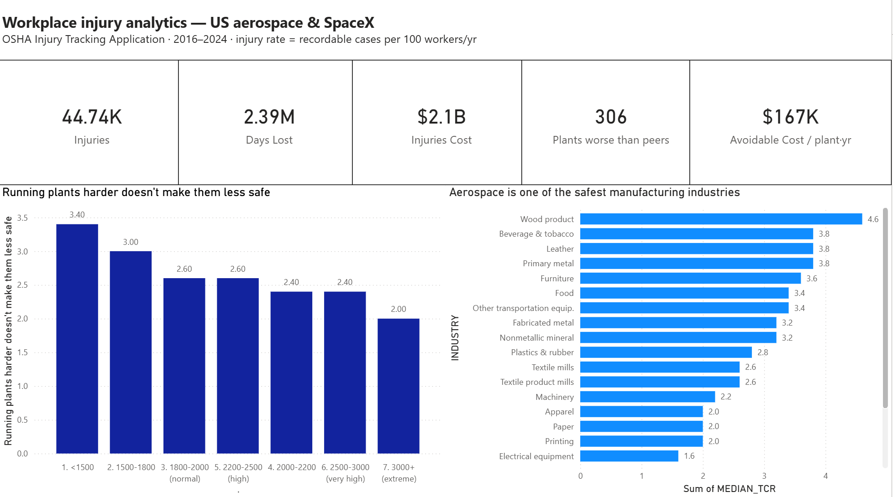
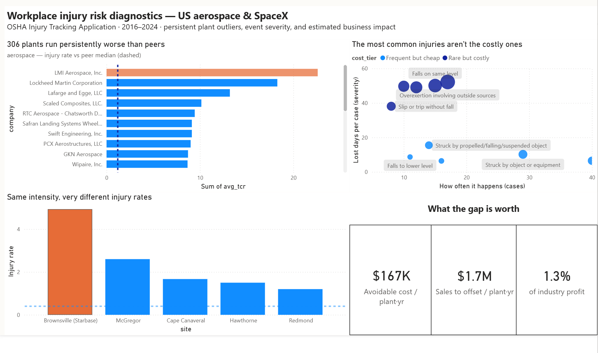

# OSHA Workplace Injury Risk Analytics — US Aerospace & SpaceX

Turning 4.4M public workplace-injury records into a peer-benchmarking tool that flags the plants worth fixing — and shows what fixing them is worth.

*Snowflake · SQL · Power BI*

---

## The short version

US aerospace manufacturing sounds dangerous, but as an *industry* it's actually one of the safest in manufacturing. The real risk isn't the industry — it's a specific set of plants that run persistently worse than their own peers, year after year. This project builds a tool that finds those plants from public OSHA data, estimates what their gap costs, and shows where prevention money actually pays off. The same method runs on any industry by changing one filter.

## Dashboard


*Page 1 — the landscape: headline numbers, the intensity myth, and where aerospace sits among manufacturing industries.*


*Page 2 — the diagnostic: which plants lag their peers, which injuries drive cost, the SpaceX site comparison, and what the gap is worth.*

## What I found (in plain language)

1. **Running plants harder doesn't make them less safe.** Higher labor intensity (longer hours per worker) isn't linked to higher injury rates — it's flat to slightly lower. Cutting overtime is not a safety lever.
2. **Industry sets the baseline, and aerospace is already low-risk.** Injury rates vary about 4x across manufacturing; aerospace sits near the safe end, well below wood, metal, and food processing.
3. **But 306 plants run persistently worse than their peers.** Comparing each plant to its *own* industry — not to manufacturing as a whole — isolates the plants with a real, controllable problem that industry averages hide.
4. **The cost hides in a few injury types.** The most common injuries (struck-by, contact) are cheap — about 6–10 lost days each. The costly ones (overexertion, same-level falls) are rarer but run ~50 days each. About a quarter of injury types drive most of the lost time.
5. **The opportunity is real and sized.** A typical persistent-outlier plant runs about **$167K/year** in avoidable injury cost — roughly **1.3% of industry profit**, or **$1.7M in sales** needed to offset it.
6. **SpaceX case study.** SpaceX's mature flagship (Hawthorne) runs a low injury rate; its fast-scaling new site (Starbase) runs ~3x higher — at the *same* hours per worker. The gap isn't overtime; it points to workforce newness and process maturity, which is an onboarding/training opportunity, not a throughput problem.

## A judgment call I'm proud of

My first "avoidable cost" estimate came out around **$1.6 billion**. Before trusting it, I checked it against the industry total and saw it implied 75% of all injuries were avoidable — which can't be right. The cause was skewed data plus a few one-off bad years counted as chronic. I tightened the method to persistent multi-year outliers and reported the *typical* plant instead of a tail-driven total, landing on the defensible ~$167K/plant figure.

Full write-up: [docs/analyst_judgment_inflated_metric.md](docs/analyst_judgment_inflated_metric.md).

## How it's built

**Data.** OSHA Injury Tracking Application (ITA) public bulk files, 2016–2024 — 4.4M raw records across summary (300A) and case-detail (300/301) tables.

**Stack.** Snowflake (ELT, medallion architecture: RAW → CLEAN → ANALYTICS), SQL, Power BI.

**Pipeline.** Raw CSVs land in a RAW layer (all text); SQL views then type-cast, normalize NAICS, derive rate metrics (per 200k hours), de-duplicate (QUALIFY / ROW_NUMBER), and filter to a clean ~2.4M-row analysis base. Data-quality checks at each step (row counts, null/label validation, sanity ranges).

**Method.** Within-industry peer benchmarking (industry-year medians via window functions), persistent-outlier detection (above peer median in 3+ years), event-severity analysis from case detail, and a cost model using the national average lost-time claim cost ($47,316, NSC/NCCI).

## Reproducing for another industry

The pipeline is industry-agnostic — point the scorecard and cost queries at a different NAICS prefix (e.g., automobile manufacturing 3361–3363) and the same outputs regenerate. The aerospace run is the worked example.

## Repo structure

```
sql/         medallion build + analysis queries
results/     analysis outputs (CSV) feeding the dashboard
docs/        methodology, findings, the judgment write-up
dashboard/   Power BI theme + screenshots
data/        data source notes (raw files not committed)
```

## Honest limitations

- This is **public, cross-company, self-reported** data. It supports a **method and a per-plant benchmark**, not an audited "$X for company Y." Everything is framed that way on purpose.
- Injury-type labels (event/source/nature) come from OSHA's own **predicted** OIICS coding, so a portion is uncoded or low-confidence; the event breakdown is directional.
- SpaceX's manufacturing NAICS (336414) isn't part of the case-detail collection, so the SpaceX view is at the establishment-summary level, not incident-level.

---

*Data: OSHA ITA (public domain). Cost benchmark: NSC Injury Facts / NCCI.*
